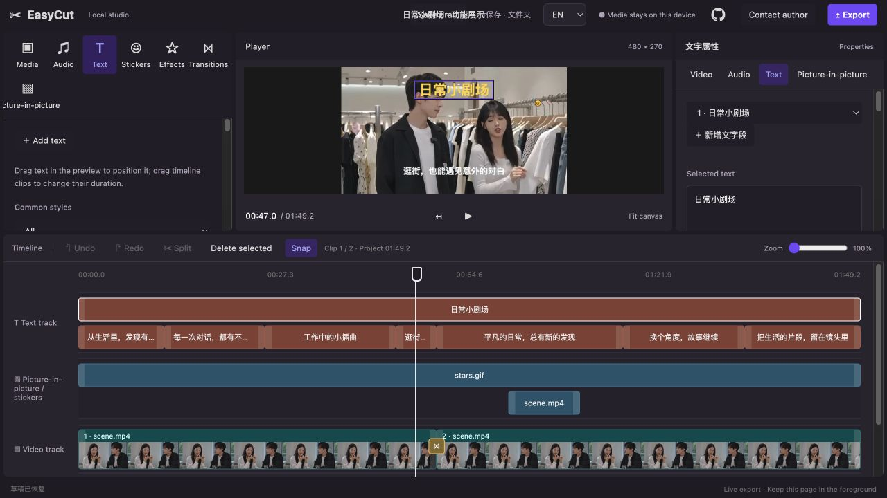
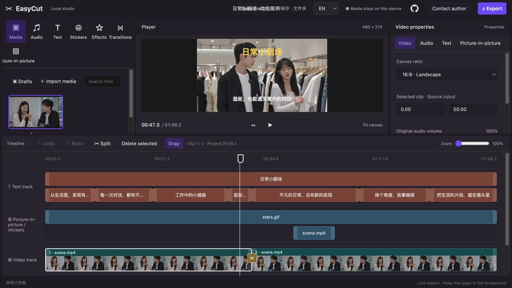
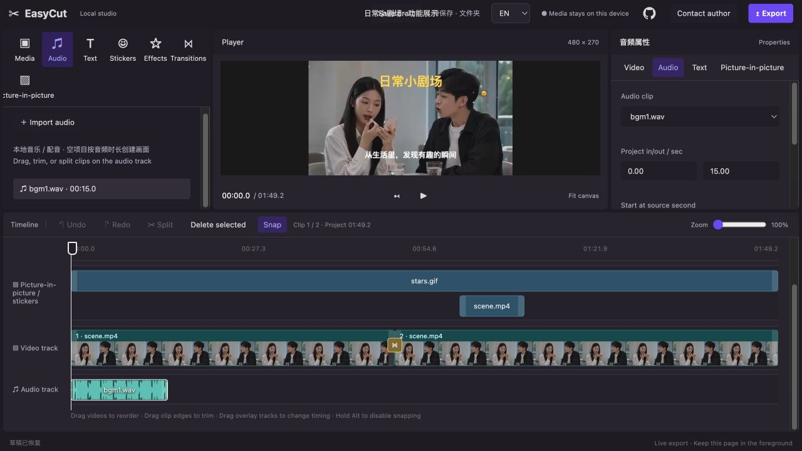
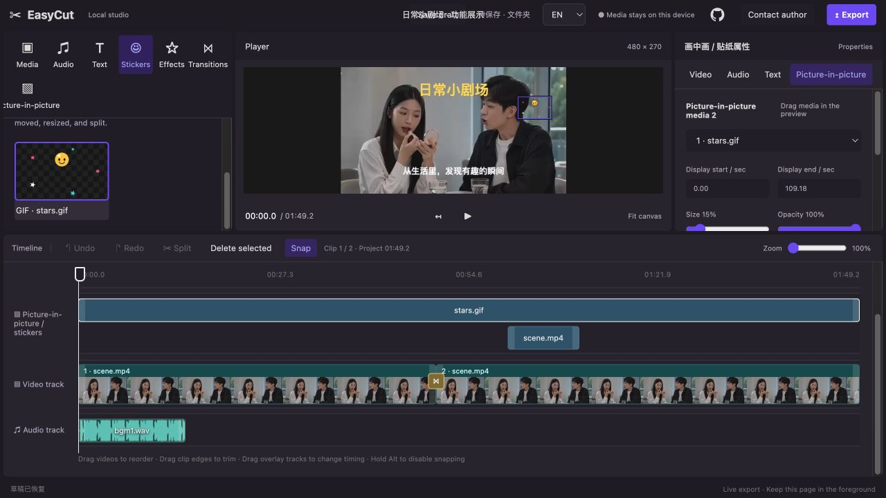
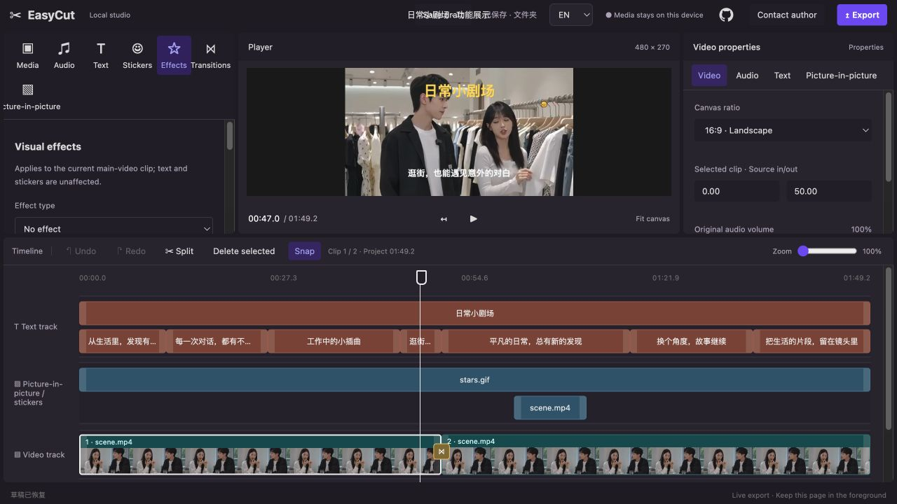
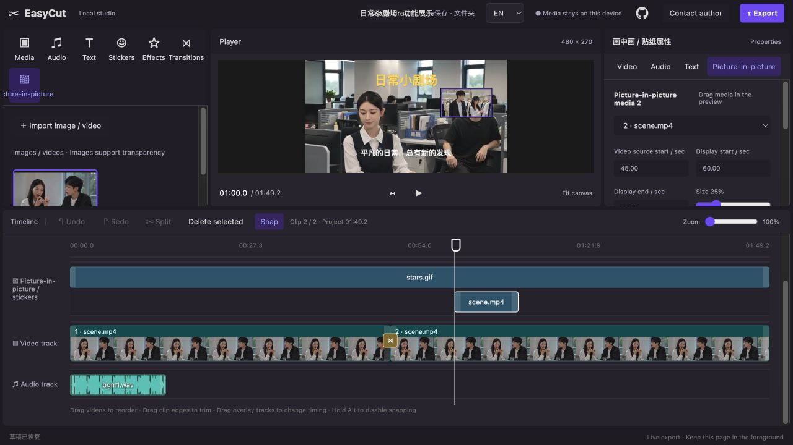

# [EasyCut](https://github.com/chengxs1994/EasyCut)

[简体中文](README.md)

EasyCut is a zero-backend video editor that runs entirely in the browser. It is built with native HTML, CSS, and JavaScript: editing, previewing, draft storage, and export all happen on the local device, so media files are never uploaded.

It also includes an AI Skill and a structured CLI. Describe an edit in natural language to a local coding assistant, let the assistant create an editable draft through the CLI, then open it in EasyCut to refine and export.

## Highlights

- Multi-clip video import, ordering, trimming, splitting, deletion, and timeline snapping.
- Start from video, images, or audio. Images become five-second still clips; audio can create a black-background video of matching duration.
- Separate video, text, picture-in-picture, sticker, and audio tracks with a shared draggable playhead.
- Multi-layer text, 18 style presets, local font import, positioning, timing, outline, background, and alignment controls.
- Transparent PNG, GIF stickers, image/video picture-in-picture, music, and audio volume up to 200%.
- Visual effects and transitions, including black/white flash, dissolve, wipes, circle reveal, and zoom fade.
- MP4 export by default, with MOV as an alternative.
- Browser drafts, authorized local-folder drafts, undo/redo, and conflict-aware local saving.
- Chinese and English editor interface. The language selection is stored in the browser.

## Quick start

Download or clone the repository and keep its directory structure intact. Open `index.html` with desktop Chrome or Edge.

Using the web editor directly requires no Python, Node.js, npm install, backend, or media upload. Export components are already included in `vendor/`. Node.js 18.3+ is only needed for the AI Skill / CLI draft workflow.

Live demo: [https://chengxs1994.github.io/EasyCut/](https://chengxs1994.github.io/EasyCut/)

## AI Skill: edit with natural language

Read [skills/jianyi-editor/SKILL.md](skills/jianyi-editor/SKILL.md) in a local coding assistant that can access files and run terminal commands. Then describe the input media, ranges to use, text, music, overlays, and whether the generated draft should be opened.

The workflow is:

`natural-language request → AI configuration → CLI draft → browser refinement → video export`

If the Skill is not installed, tell the assistant where the EasyCut project is located and ask it to read `skills/jianyi-editor/SKILL.md` before editing. The repository does not install a Skill automatically.



This example crops the original burned-in text out of the frame, then uses the Skill / CLI to add an editable title and separate caption segments. The captions are demonstration copy, not speech recognition output.

> Example request: Create an editable draft from a local landscape video. Add a yellow title, caption segments, background music, and a GIF sticker, then open it in the editor.

## Structured CLI

The CLI is the execution interface used by the Skill and can also create editable local drafts from JSON. It has no npm runtime dependencies and supports clips, text, audio, stickers, picture-in-picture, effects, and transitions.

```sh
node cli/jianyi.mjs create /path/to/edit.json
node cli/jianyi.mjs create /path/to/edit.json --open
node cli/jianyi.mjs open --draft DRAFT_ID
node cli/jianyi.mjs update changes.json --draft DRAFT_ID --open
```

`--open` starts the local editor with the generated draft. Keep the CLI terminal open until the editor shows that the draft has been saved. The service listens only on the local machine and does not upload media.

See [CLI documentation](cli/README.md) and [example.json](cli/example.json) for the JSON schema and examples.

## Drafts and local media

Browser drafts are stored in IndexedDB and do not sync between browsers, site addresses, or devices. Use the **Drafts** button to save, open, rename, duplicate, delete, or copy a draft ID.

Chrome and Edge can additionally save drafts into a user-authorized folder using the File System Access API. The `jianyi-drafts` folder contains `project-index.json`, media under `assets/`, and CLI draft packages under `cli-drafts/`. Copy the entire folder for backup or migration. The browser never accesses a folder until the user selects and authorizes it.

By default, Skill/CLI drafts are placed in an `EasyCut` folder under the current user home directory. Use `--output` to choose another library. A normal browser page and the CLI use separate draft libraries until you open the same directory in the browser or start the CLI with `--open`.

## Screenshots

### Editor overview


### Video clips



### Audio



### Text


### Stickers



### Effects



### Transitions


### Picture-in-picture



## Mobile layout

On mobile, EasyCut uses a preview, timeline, and bottom-panel layout. The bottom panel switches between Media and Properties, while the main video track remains prioritized. Touch gestures and mobile-browser export compatibility need broader device validation.

## Project structure

```text
index.html             Editor structure
style.css              Editor styles
js/i18n.js             Chinese / English interface localization
js/app.js              Editing state, interactions, preview composition, recording
js/text-presets.js     Text-style preset catalog
js/draft-*.js          Browser, folder, remote, and editor draft support
js/history.js          Undo / redo history
js/timeline-edit.js    Timeline reordering, trimming, and snapping
vendor/                Browser-ready export components and notices
cli/                   Dependency-free structured editing CLI
skills/jianyi-editor/  Skill instructions for AI-assisted draft creation
```

## Development

Refresh the page after changing HTML, CSS, or JavaScript. Installing dependencies is only required when rebuilding the export wrapper:

```sh
npm ci
npm run build:export
```

Before committing, run syntax and diff checks:

```sh
node --check js/i18n.js
node --check js/app.js
node --check js/draft-store.js
node --check js/draft-folder.js
node --check js/draft-editor.js
node --check js/draft-manager.js
node --check js/history.js
git diff --check
```

## Roadmap

AI tools such as voice-over, voice cloning, subtitle recognition, and audio extraction; reusable media caching; and batch scripts are planned. They are not included in the open-source browser edition and do not require an AI service deployment.

## License

See [LICENSE](LICENSE). Personal, learning, commercial projects, internal deployment, and redistribution are permitted. Running an unauthorized paid hosted editor, SaaS, website, or API for third parties requires prior written authorization.

## Contact


WeChat ID: `xsxsaiai`
