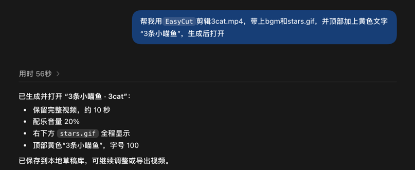
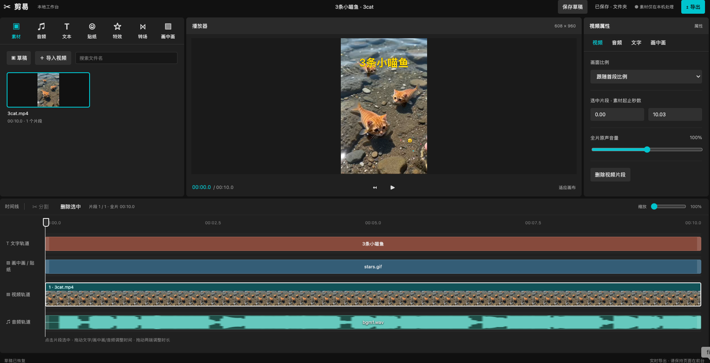
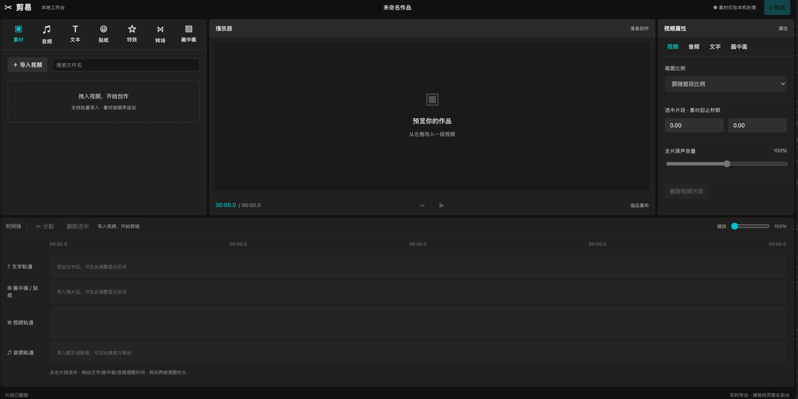
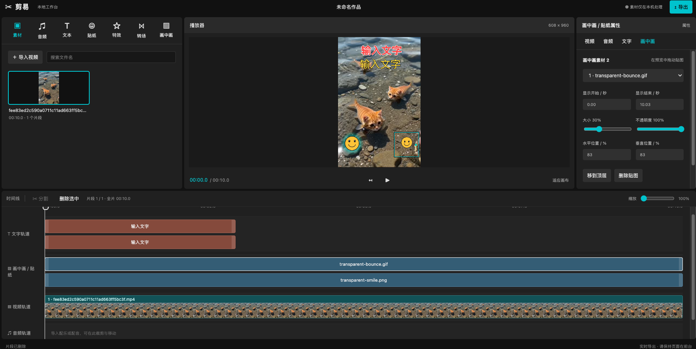
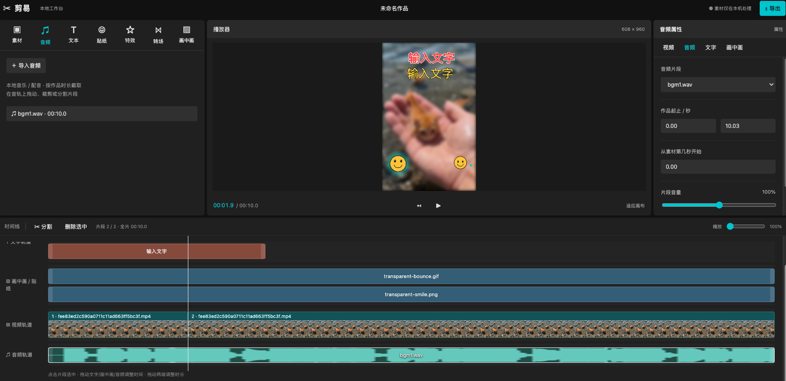
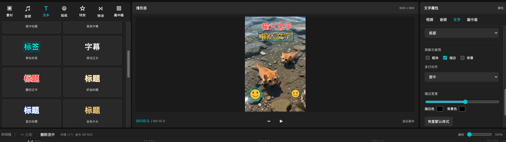
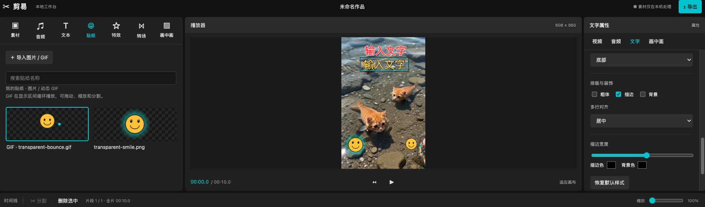
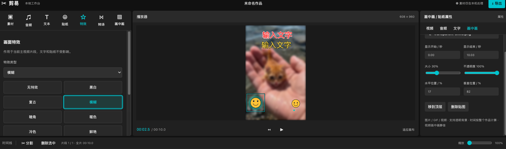
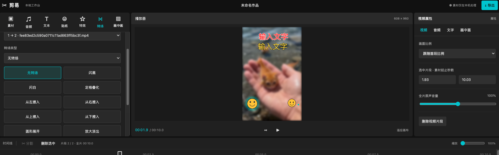
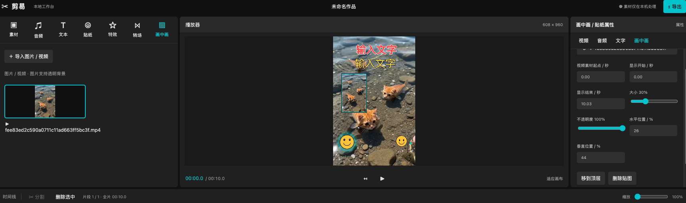

# 剪易 EasyCut

一个纯浏览器（开箱即用）视频编辑器，支持通过 AI Skill 进行语义化剪辑，使用原生 HTML、CSS 和 JavaScript 构建。基础剪辑、预览和导出均在本机浏览器内完成，无需后端，也不会上传素材。

用自然语言描述需求，由 AI 调用 CLI 生成本地草稿，再打开网页预览、调优和导出。也可直接使用 CLI，通过 JSON 配置完成结构化剪辑。

## 用自然语言剪辑：AI Skill

通过项目提供的 [jianyi-editor Skill](skills/jianyi-editor/SKILL.md)，你可以直接向 AI 描述剪辑需求，无需自己编写 JSON。AI 会把需求转换成结构化配置，调用 EasyCut CLI 生成本地草稿，再打开网页供你预览、调优和导出。



流程为：**自然语言需求 → AI 生成配置 → CLI 创建草稿 → 网页预览调优 → 导出视频**。说“生成后打开”时，AI 可使用 `--open` 直接进入生成的草稿；草稿和素材默认保存在当前用户主目录的 `EasyCut` 文件夹中。编辑服务需保持运行，网页修改会保存回同一个库。



目前支持明确时间范围内的裁剪拼接、文字、配乐、贴纸、画中画，以及已有的特效和转场。Skill 是 AI 助手的操作入口，网页内尚未提供聊天剪辑框；不具备内置的画面理解、自动找精彩片段或语音识别能力。未指定片段时间时，需要 AI 使用已有工具读取真实时长，或由你补充。生成的是可编辑草稿，最终视频需在网页导出。

### 如何使用

准备好项目、本地素材和 Node.js 18.3+，使用能读取本地文件、执行终端命令的 AI 编程助手。拉取项目不会自动安装 Skill；未安装时也可以直接告诉 AI：

> EasyCut 项目位于 `/你的路径/EasyCut`。请先阅读 `skills/jianyi-editor/SKILL.md`，按其中的流程完成剪辑。

然后用自然语言说明素材位置、剪辑时间范围、文字与配乐要求，以及是否需要生成后打开网页。

## 快速开始

下载项目并解压，保持目录完整，直接双击 `index.html`，使用桌面版 Chrome 或 Edge 打开即可。如果默认浏览器不是 Chrome 或 Edge，可右键选择「打开方式」。

**直接使用网页无需安装 Python、Node.js 或 npm 依赖。** 运行所需的导出组件已包含在 `vendor/` 中。本机 Chrome 已验证直接打开时的视频与音频编辑、PNG / 动态 GIF 贴纸和导出功能。使用 Skill / CLI 生成草稿时需 Node.js 18.3+，无需安装 npm 依赖。

## 基础功能

- 导入多段视频，拼接、分割、裁剪和删除片段。
- 视频、文字、画中画和音频轨道，共用可拖动播放头。
- 添加文字、18 种文字样式预设、导入字体、调整画面位置和显示时间。
- 导入图片、透明 PNG、动态 GIF 和静音视频作为画中画或贴纸。
- 导入配乐，调整原声和配乐音量（默认 100%，上限 200%）。
- 10 种视频特效、9 种转场。
- 导出 MP4 或 MOV，默认 MP4。
- 语义化剪辑：通过 AI Skill 将自然语言需求转换为剪辑配置，生成可继续编辑的本地草稿。
- 结构化 CLI：使用 JSON 配置编排视频、文字、配乐、贴纸、特效和转场，支持向同一草稿库追加作品。
- 生成后直接打开：通过 `--open` 进入网页预览调优，修改保存回同一本地草稿库。

## 功能截图

### 主界面


### 导入视频


### 音频


### 文本
**支持自定义文字样式**


### 贴纸
**支持导入图片、透明PNG和动态GIF作为贴纸**


### 特效


### 转场


### 画中画
**支持导入图片和视频作为画中画**


## 使用流程

1. 在「素材」中导入主视频，素材按顺序加入视频轨道。
2. 拖动播放头定位，选择片段后分割或删除。
3. 从「文本」「音频」「贴纸」「画中画」添加内容，在右侧调整属性。
4. 拖动覆盖轨道片段调整时间，拖动两端调整时长；在预览中拖动文字和画中画调整位置。
5. 添加特效或转场，预览后点击右上角「导出」。

在线体验：[https://chengxs1994.github.io/EasyCut/](https://chengxs1994.github.io/EasyCut/)

## 开发中功能

| 功能 | 状态 | 计划 |
| --- | --- | --- |
| AI 工具 | 开发中 | 接入配音、声音克隆、字幕识别和音频提取等服务 |
| 素材缓存 | 开发中 | 将导入素材保存到授权目录，方便后续复用 |
| 批量脚本 | 开发中 | 使用 JSON 配置批量执行剪辑与导出 |

当前源码公开基础版不包含以上三个模块的实现和界面入口，也不需要部署 AI 服务。

## 本地草稿

打开页面直接进入编辑工作台，不自动弹出草稿列表。需要新建或打开已有草稿时，点击「素材」导入栏旁的「草稿」按钮。直接导入素材，会在首次自动保存时创建“未命名作品”。

- 编辑停止约 1 秒后自动保存，也可点击顶部「保存草稿」。以“已保存”状态为准；播放、导出和拖拽期间暂缓保存。
- 草稿包含视频、音频、图片、GIF、导入字体的素材副本，以及各轨道、字号、特效、转场、画布比例、音量和播放位置。
- 支持新建、打开、重命名、复制和删除。副本共享素材；浏览器草稿自动清理无引用素材，文件夹草稿需手动点击「清理未引用素材」。
- 素材读取失败时保留当前作品，可在列表点击「重新关联素材」，选择同名、同大小的原文件。验证成功后另存恢复副本，保留原草稿供检查。
- 存储失败时保留内存编辑状态，不会显示“已保存”；可在列表删除旧草稿腾出空间，然后手动保存。多个页面同时编辑同一草稿时会检测写入冲突。

草稿和素材保存在当前浏览器的 IndexedDB 中，不会上传。不同浏览器、网址（本地文件、localhost、GitHub Pages）之间的草稿不互通。清理站点数据、浏览器回收存储或隐私模式结束都可能导致草稿丢失；重要作品仍应及时导出。关闭页面前的异步写入无法保证完成，请确认状态显示“已保存”。

### 保存到本地文件夹

草稿列表提供两个独立入口：「打开本地草稿」用于浏览已有草稿，当前作品先保存到原位置，不会复制到目标目录；「另存到文件夹」用于把当前作品另存副本，随后自动保存到新位置。另存时会按需建立 `jianyi-drafts` 子目录。两个入口均支持选择外层作品目录或内部 `jianyi-drafts` 目录。

- `project-index.json` 保存网页草稿配置和封面；`assets/` 保存网页素材副本；`cli-drafts/` 保存 CLI 生成的草稿包。单份草稿内重复素材会复用，不同 CLI 任务暂不跨作品去重；后续编辑主要更新配置。
- 刷新后点击最近目录恢复访问，必要时授权，再从列表选择草稿；最多记住五个目录，也可以重新选择文件夹。点击「浏览器草稿」会先保存当前作品，再返回浏览器列表。
- 删除文件夹草稿只删除配置。点击「清理未引用素材」才删除没有任何草稿使用的素材副本，不影响导入前的原始文件。
- 备份或迁移时请复制整个 `jianyi-drafts` 目录；不要手动修改内部文件，也不要从不同浏览器同时编辑同一目录。权限失效或磁盘写入失败会保留当前编辑内容并提示未保存。

目录写入适用于支持 File System Access API 的桌面 Chrome/Edge，建议使用 HTTPS 或 localhost；不支持的浏览器仍可使用浏览器草稿。无需后端服务。此模式减少浏览器数据库中的素材占用，但视频解码和预览仍需要内存。清理站点数据不会删除所选目录里的文件，仅需要重新选择目录。

## 代码结构

```text
index.html            页面结构
style.css             工作台样式
js/app.js             剪辑状态、交互、预览合成与录制
js/text-presets.js     文字样式预设
js/export-mux.js       MP4 / MOV 封装入口
js/draft-store.js      草稿和素材事务存储、版本冲突及引用清理
js/draft-folder.js     用户授权文件夹存储、素材复用与手动清理
js/draft-editor.js     工程快照、媒体解码与恢复适配
js/draft-manager.js    草稿列表、自动保存、管理与失败提示
vendor/               浏览器可直接使用的导出组件及许可证
cli/                  零 npm 依赖的结构化剪辑 CLI、配置示例与检查
skills/jianyi-editor/  AI 调用 CLI 生成草稿的 Skill
package.json          导出组件构建配置
package-lock.json     固定构建依赖版本
```

## 结构化剪辑 CLI

CLI 是上述 Skill 使用的执行接口，也可以独立使用 JSON 配置生成本地草稿。只需 Node.js，无需 npm 安装依赖或 ffprobe。涵盖视频拼接裁剪、多段文字、音频、贴纸、画中画及已有特效转场。使用说明见 [CLI 文档](cli/README.md)，示例见 [example.json](cli/example.json)。

```sh
node cli/jianyi.mjs create /path/to/edit.json
node cli/jianyi.mjs create /path/to/edit.json --open
node cli/jianyi.mjs open --draft 草稿ID
```

加 `--open` 可在生成后直接打开网页调优，修改保存回同一草稿库，无需手动选择文件夹。已有草稿用 `open --draft 草稿ID`，只运行 `open` 则显示草稿列表。**保持终端运行，网页显示「已保存」后再按 Ctrl+C 停止。** 本地服务仅监听本机，不上传到外网，也无需额外依赖。

也可在普通网页点击「草稿 → 打开本地草稿」，选择默认 EasyCut 草稿库或内部 jianyi-drafts 目录。后续生成后点击「刷新列表」。--output 可指定其他库。create 已包含校验；AI 调用追加 `--json`。请使用最新版网页读取 CLI 草稿包。CLI 不渲染视频，素材真实时长和解码由网页检查；默认追加到用户主目录下 EasyCut 草稿库，支持多次和并发生成，不覆盖已有草稿。

### 网页与 Skill 的保存位置

| 使用方式 | 默认保存位置 |
| --- | --- |
| 网页直接编辑 | 当前浏览器的草稿存储 |
| 网页打开本地草稿后编辑 | 用户选择并授权的草稿库 |
| Skill / CLI 生成 | 当前系统用户主目录下的 `EasyCut` 文件夹 |
| CLI open 打开的网页 | 启动命令指定的草稿库，默认同上 |

默认目录不是固定的开发者路径：macOS 通常为 `/Users/用户名/EasyCut`，Windows 为 `C:\Users\用户名\EasyCut`，Linux 为 `/home/用户名/EasyCut`。CLI 会显示实际目录，与项目下载位置无关。

**普通网页不会自动使用 CLI 默认目录，Skill 也不会自动获知网页选择了哪个目录。** 使用 `--open` 可直接连接生成所在的库；普通网页首次共用时，在「草稿 → 打开本地草稿」选择同一个 EasyCut 目录并授权，之后可从最近目录进入。服务运行期间请在服务窗口编辑，普通网页的同库写入会被阻止；生成新作品后点击「刷新列表」。

如果两边选择不同目录，就是两个独立草稿库，不会自动同步或合并。要让 Skill 写入网页使用的其他目录，明确提供该目录，并使用：

```sh
node cli/jianyi.mjs create edit.json --output "/你的草稿库路径"
```

旧的独立草稿目录不会自动迁入默认库。拉取项目也不会自动安装 Skill；可让 AI 先阅读项目的 `skills/jianyi-editor/SKILL.md` 再执行。

## 开发


修改 HTML、CSS 或业务 JavaScript 后刷新页面即可。仅在修改导出封装组件时安装依赖并重新构建（需要 Node.js 和 npm）：

```sh
npm ci
npm run build:export
```

提交前执行语法检查和差异检查，并在浏览器中验证涉及的功能：

```sh
node --check js/app.js
node --check js/text-presets.js
node --check js/export-mux.js
node --check js/draft-store.js
node --check js/draft-folder.js
node --check js/draft-editor.js
node --check js/draft-manager.js
git diff --check
```

欢迎通过 GitHub Issues 反馈问题，或提交 Pull Request。请说明复现步骤、浏览器版本及预期行为；不要提交私人素材、密钥或依赖安装目录。新增方法请附中文注释。

## 联系我


## 许可证

 [许可证](LICENSE)

- 允许个人、组织和企业进行个人、学习和商业使用，包括商业项目、企业内部部署、客户项目和软件分发。
- 仅限制未经授权将项目部署为面向第三方的收费在线编辑器、SaaS、托管站点或 API。
- 免费在线部署、企业内部部署和离线使用不受此条限制；受限的收费在线服务须先取得书面授权。
- 分发原版或修改版时须保留许可证、著作权声明和修改说明。

## Star

### 方便的话，帮忙给项目一个宝贵的star哈，谢谢啦！
